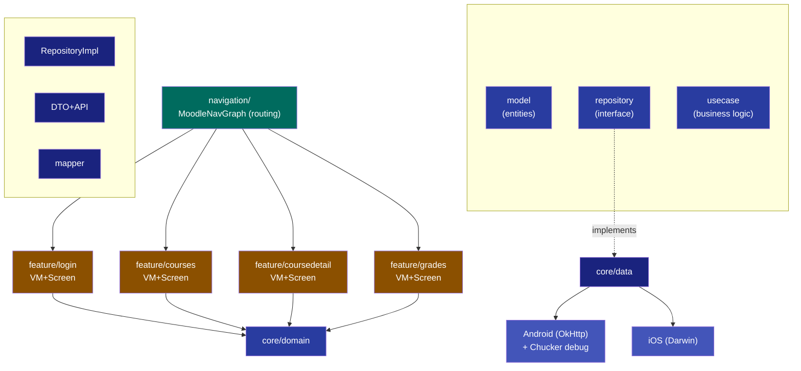
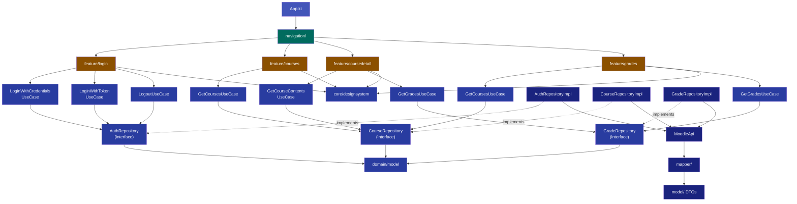

# Moodle Client

A cross-platform mobile application for **Android** and **iOS** that integrates with a Moodle LMS via REST APIs. Built with **Kotlin Multiplatform** and **Compose Multiplatform**, sharing 100% of business logic and UI code across both platforms.

## Screenshots

The app features three main screens:

| Screen | Description |
|--------|-------------|
| **Courses** | Displays enrolled courses with images, progress bars, and completion badges |
| **Course Details** | Shows course content sections and grade items in tabbed view |
| **Grades** | Aggregated grade overview across all enrolled courses |

## Architecture

The project follows a **feature-based clean architecture** with clear separation between `core` and `feature` modules:



### Pattern: MVVM + Clean Architecture (SOLID)

- **S** — *Single Responsibility*: Each repository handles one domain (`AuthRepository`, `CourseRepository`, `GradeRepository`). Each use case encapsulates exactly one operation.
- **O** — *Open/Closed*: New data sources or caching can be added by creating new repository implementations without modifying existing use cases or ViewModels.
- **L** — *Liskov Substitution*: All `*RepositoryImpl` classes are fully substitutable for their domain interfaces (e.g. for testing with fakes).
- **I** — *Interface Segregation*: ViewModels depend only on the use cases they need; use cases depend only on the specific repository interface they require.
- **D** — *Dependency Inversion*: All feature-layer code depends on `domain/` abstractions. Concrete implementations in `data/` are injected at runtime via Koin.

### Dependency Flow



### Key Libraries

| Library | Purpose |
|---------|---------|
| **Compose Multiplatform 1.10.3** | Shared UI framework (Jetpack Compose on Android, native rendering on iOS) |
| **Ktor 3.1.3** | HTTP client (OkHttp engine for Android, Darwin engine for iOS) |
| **Kotlinx Serialization 1.8.1** | JSON parsing with `@Serializable` DTO data classes |
| **Koin 4.1.0** | Dependency injection (multiplatform) |
| **Coil 3.2.0** | Async image loading with SVG support |
| **Navigation Compose** | Type-safe navigation with bottom navigation bar |
| **Chucker 4.3.1** | HTTP inspector (debug builds, Android only) |

## Project Structure

```
composeApp/src/
├── commonMain/kotlin/io/versology/moodleclient/
│   ├── App.kt                                    # Entry point + Koin + Coil SVG init
│   ├── core/
│   │   ├── common/
│   │   │   └── UiState.kt                        # Shared sealed class (Loading/Success/Error)
│   │   ├── data/
│   │   │   ├── SessionManager.kt                 # Auth session state
│   │   │   ├── model/                             # DTOs (@Serializable, raw API shapes)
│   │   │   │   ├── Auth.kt                        #   LoginResponseDto, SiteInfoDto
│   │   │   │   ├── Course.kt                      #   CourseDto
│   │   │   │   ├── CourseSection.kt               #   CourseSectionDto, CourseModuleDto
│   │   │   │   └── GradeReport.kt                 #   GradeReportResponseDto, GradeItemDto
│   │   │   ├── mapper/                            # DTO → Domain mapping extensions
│   │   │   │   ├── AuthMapper.kt
│   │   │   │   ├── CourseMapper.kt
│   │   │   │   ├── CourseSectionMapper.kt
│   │   │   │   └── GradeReportMapper.kt
│   │   │   ├── network/
│   │   │   │   ├── ApiConstants.kt                # Base URL, endpoints, test credentials
│   │   │   │   └── MoodleApi.kt                   # Ktor HTTP client
│   │   │   └── repository/
│   │   │       ├── AuthRepositoryImpl.kt           # Implements AuthRepository
│   │   │       ├── CourseRepositoryImpl.kt         # Implements CourseRepository
│   │   │       └── GradeRepositoryImpl.kt          # Implements GradeRepository
│   │   ├── domain/
│   │   │   ├── model/                             # Clean domain models (no serialization)
│   │   │   │   ├── Course.kt
│   │   │   │   ├── CourseSection.kt
│   │   │   │   ├── GradeItem.kt
│   │   │   │   └── SiteInfo.kt
│   │   │   ├── repository/                        # Segregated interfaces (ISP)
│   │   │   │   ├── AuthRepository.kt              #   Login, logout, session
│   │   │   │   ├── CourseRepository.kt            #   Course listing + contents
│   │   │   │   └── GradeRepository.kt             #   Grade retrieval
│   │   │   └── usecase/                           # Business logic operations
│   │   │       ├── GetCoursesUseCase.kt
│   │   │       ├── GetCourseContentsUseCase.kt
│   │   │       ├── GetGradesUseCase.kt
│   │   │       ├── LoginWithCredentialsUseCase.kt
│   │   │       ├── LoginWithTokenUseCase.kt
│   │   │       └── LogoutUseCase.kt
│   │   ├── designsystem/
│   │   │   ├── theme/
│   │   │   │   └── MoodleTheme.kt                 # Material 3 color scheme + typography
│   │   │   └── component/                         # Shared reusable components
│   │   │       ├── ErrorView.kt
│   │   │       ├── LoadingView.kt                 # Shimmer skeletons
│   │   │       └── SectionHeader.kt
│   │   └── di/
│   │       └── AppModule.kt                       # Koin module (expect/actual)
│   ├── feature/
│   │   ├── login/
│   │   │   ├── LoginScreen.kt                     # Credentials + Token login tabs
│   │   │   └── LoginViewModel.kt
│   │   ├── courses/
│   │   │   ├── CoursesScreen.kt
│   │   │   ├── CoursesViewModel.kt
│   │   │   └── component/
│   │   │       └── CourseCard.kt                  # Course card with image + progress
│   │   ├── coursedetail/
│   │   │   ├── CourseDetailScreen.kt              # Content + Grades tabs
│   │   │   └── CourseDetailViewModel.kt
│   │   └── grades/
│   │       ├── GradesScreen.kt                    # Per-course grade summaries
│   │       ├── GradesViewModel.kt
│   │       └── component/
│   │           └── GradeItemRow.kt                # Grade row with mini progress bar
│   └── navigation/
│       └── MoodleNavGraph.kt                      # Routes + bottom nav bar
├── androidMain/                                    # Android: OkHttp engine + Chucker
└── iosMain/                                        # iOS: Darwin engine
```

## Setup Instructions

### Prerequisites

- **Android Studio Ladybug** (2024.2+) or **IntelliJ IDEA** with Kotlin Multiplatform plugin
- **JDK 21+**
- **Xcode 15+** (for iOS builds, macOS only)

### Android

1. Clone the repository
2. Open the project in Android Studio
3. Wait for Gradle sync to complete
4. Select the `composeApp` run configuration
5. Run on an emulator or physical device

```bash
# Build from terminal
./gradlew :composeApp:assembleDebug
```

### iOS

1. Open `iosApp/iosApp.xcodeproj` in Xcode
2. Select an iOS simulator target
3. Build and run

Or use Android Studio / IntelliJ with the KMP plugin to run the iOS target directly.

## API Integration

### Moodle REST API

| Endpoint | Function | Description |
|----------|----------|-------------|
| Login | `/login/token.php` | Authenticate with username/password (Option A) |
| Site Info | `core_webservice_get_site_info` | Validate token and fetch user profile |
| Courses | `core_enrol_get_users_courses` | List enrolled courses with progress |
| Contents | `core_course_get_contents` | Course sections and modules |
| Grades | `gradereport_user_get_grade_items` | Grade items per course |

**Base URL:** `https://moodle.itcorner.qzz.io`  
**Authentication:** Option A (credentials) or Option B (pre-generated token)

## Implementation Decisions

### Why Feature-Based Architecture with SOLID?

- **Scalability** — each feature is self-contained with its own screen, viewmodel, and components
- **Discoverability** — finding code for a feature means looking in one directory
- **Interface Segregation** — `AuthRepository`, `CourseRepository`, `GradeRepository` ensure consumers depend only on what they need
- **Dependency Inversion** — ViewModels → UseCases → Repository interfaces; concrete implementations injected at runtime
- **Testability** — every boundary is an interface; swap `AuthRepositoryImpl` for a fake in tests without touching any feature code
- **Clean boundary** — DTOs live in `core/data/model`, domain models in `core/domain/model`, with explicit mappers between them

### Why Compose Multiplatform (not separate SwiftUI + Jetpack Compose)?

- **Maximum code sharing** — 100% of UI and business logic is shared
- **Consistent behavior** — identical rendering across platforms
- **Single source of truth** — one codebase to maintain
- **Still native** — compiles to ARM64 native binaries on iOS via Kotlin/Native

### Why Ktor over Retrofit?

- **Multiplatform** — works on both Android (OkHttp engine) and iOS (Darwin engine) from shared code
- **Kotlin-first** — coroutine-native, works seamlessly with Kotlinx Serialization

### Error Handling Strategy

- Network calls wrapped in `Result<T>` at the repository layer
- ViewModels map `Result` to `UiState.Success` or `UiState.Error`
- Screens display appropriate shimmer loading, error + retry, or content
- All three states are handled for every screen

### Design Choices

- **Material 3** with custom indigo/teal color scheme
- **Light & Dark mode** support via `isSystemInDarkTheme()`
- **Color-coded grades** — green (≥80%), lime (≥60%), amber (≥40%), red (<40%)
- **Animated progress bars** with smooth transitions
- **Shimmer loading skeletons** for polished loading states

---

Built with ❤️ using Kotlin Multiplatform